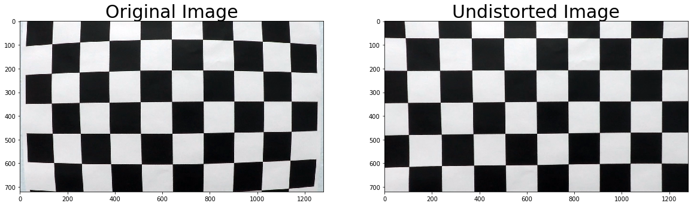
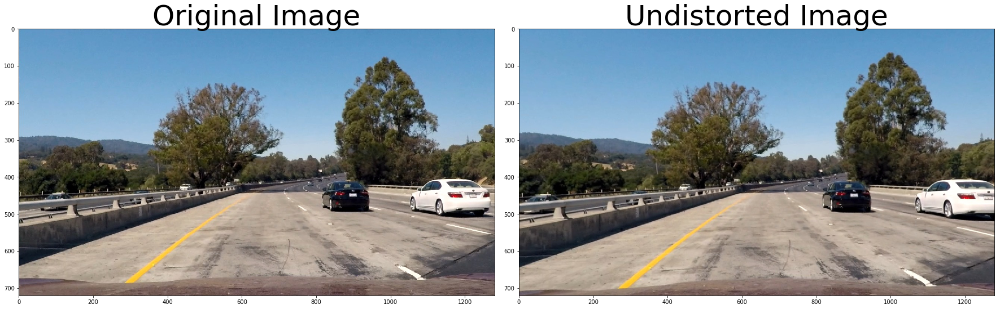
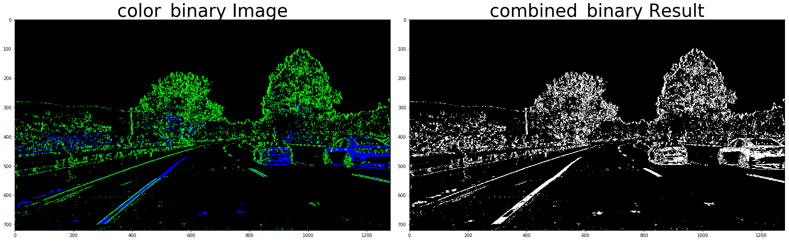
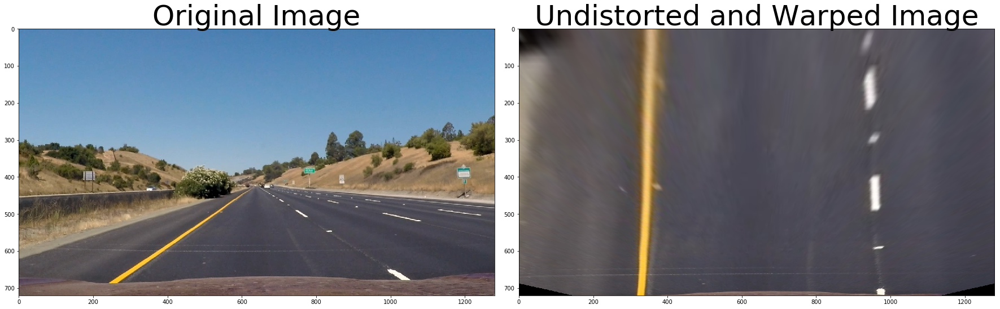
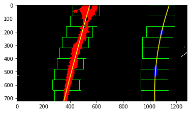
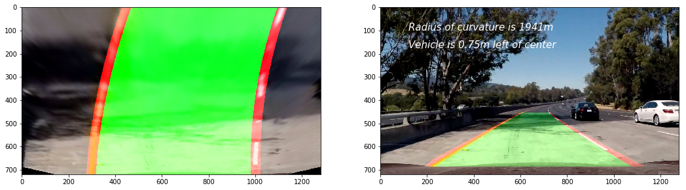
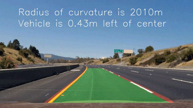

## Advanced Lane Finding Writeup
[](http://www.udacity.com/drive)

***
### Advanced Lane Finding Project  

The goals / steps of this project are the following:  
    1. Compute the camera calibration matrix and distortion coefficients given a set of chessboard images.  
    2. Apply a distortion correction to raw images  
    3. Use color transforms, gradients, etc., to create a thresholded binary image  
    4. Apply a perspective transform to rectify binary image ("birds-eye view")  
    5. Detect lane pixels and fit to find the lane boundary.  
    6. Determine the curvature of the lane and vehicle position with respect to center  
    7. Warp the detected lane boundaries back onto the original image  
    8. Output visual display of the lane boundaries and numerical estimation of lane curvature and vehicle
position.  

***

### Camera Calibration
---
#### 1. Have the camera matrix and distortion coefficients been computed correctly and checked on one of the calibration images as a test?

The code for this step is contained in the first code cell of the IPython notebook  

a. prepare object points,which will be the (x, y, z) coordinates of the chessboard corners in the world. Here I am assuming the chessboard is fixed on the (x, y) plane at z=0, such that the object points are the same for each calibration image.  
b. use the OpenCV functions findChessboardCorners and drawChessboardCorners to identify the locations of corners on a series of pictures of a chessboard taken from different angles.

```python
img = cv2.imread(fname)
gray = cv2.cvtColor(img, cv2.COLOR_BGR2GRAY)

# Find the chessboard corners
ret, corners = cv2.findChessboardCorners(gray, (9, 6), None)

# If found, add object points, image points
if not ret != True:
    objpoints.append(objp)
    imgpoints.append(corners)

    # Draw and display the corners
    cv2.drawChessboardCorners(img, (9, 6), corners, ret)

```



---
### Pipeline (single images)
---

#### 1.  Has the distortion correction been correctly applied to each image?

To demonstrate this step, just test the distortion correction to one of the test images like this one:

```python
test_img = plt.imread('test_images/test1.jpg')
test_undist = cv2.undistort(test_img, mtx, dist, None, mtx)
```



#### 2.  Has a binary image been created using color transforms, gradients or other methods?

use ```cv2.cvtColor```(color transforms function) and ```cv2.Sobel```(gradients function) to creat a binary image.



#### 3. Has a perspective transform been applied to rectify the image?

The warper function takes as inputs an image ```img```, as well as source ```src``` and destination ```dst``` points. I chose the hardcode the source and destination points in the following manner:

```python
src = np.float32([[590,450],
                  [225,700],
                  [1055,700],
                  [690,450]])  #Source
dst = np.float32([[320,-100],
                  [320,720],
                  [960,720],
                  [960,-100]])  #Destination
```

so verified that the perspective transform was working as expected by drawing the src and dst points onto a test image.



#### 4. Have lane line pixels been identified in the rectified image and fit with a polynomial?

use the ```python find_lane_pixels(binary_warped)``` just input the binary and warped image then output like this one:



#### 5. Having identified the lane lines, has the radius of curvature of the road been estimated? And the position of the vehicle with respect to center in the lane?

here is one of the test_images output



---
### Pipeline (video)
---

#### 1. Does the pipeline established with the test images work to process the video?

use this function ```advanced_lane_pipeline(img)``` to process the video



---
### README
---
#### this is README

---
### Discussion
---

